# Globally Autoscaling Web Service on Google Cloud 

This Terraform project deploys a globally autoscaling web service on Google Cloud Platform, inspired by the movie *Interstellar*. It demonstrates concepts such as:

*   **Infrastructure as Code (IaC):** All resources are defined using Terraform, making deployments repeatable and predictable.
*   **Autoscaling:** Instance groups automatically scale based on CPU utilization to handle varying traffic loads.
*   **Global Load Balancing:** A global HTTP(S) load balancer distributes traffic across instances in multiple regions, providing high availability and low latency.
*   **Managed Instance Groups (MIGs):** Regional MIGs provide resilience and self-healing for the application instances.
*   **Cloud NAT:** Enables instances without public IP addresses to access the internet for package downloads and updates.
*   **Google Managed SSL Certificates:** Provides HTTPS encryption for secure communication.
*   **Cloud DNS:** Manages DNS records for the application.
*   **Interstellar Theme:** The web application and supporting resources are named and styled with an *Interstellar* theme.

## Architecture

The architecture consists of the following components:

1.  **Instance Template:** Defines the configuration for the instances, including machine type, image, and startup script.
2.  **Managed Instance Groups (MIGs):** Two regional MIGs are created, one in `us-central1` and another in `eu-west2`, providing high availability and geographical distribution.
3.  **Global HTTP(S) Load Balancer:** Distributes traffic across the MIGs, ensuring low latency and resilience.
4.  **Cloud NAT:** Enables instances in both regions to access the internet for package downloads and updates, even though they don't have public IP addresses.
5.  **Cloud DNS:** A DNS record is created to point to the load balancer's IP address.
6.  **Google Managed SSL Certificate:** An SSL certificate is provisioned for the application's domain, enabling secure HTTPS connections.
7.  **Storage Bucket:** A Google Cloud Storage bucket stores the static files for the web application (`index.html`, `main.css`).
8.  **Firewall Rules:** Firewall rules allow HTTP, HTTPS, SSH, and ICMP traffic to the instances. Also, allows all egress traffic.



## Prerequisites

*   **Google Cloud Project:** You need a Google Cloud project with billing enabled.
*   **Terraform:** Install Terraform on your local machine. ([https://developer.hashicorp.com/terraform/tutorials/gcp-get-started/install-cli](https://developer.hashicorp.com/terraform/tutorials/gcp-get-started/install-cli))
*   **gcloud CLI:** Install and configure the Google Cloud CLI. ([https://cloud.google.com/sdk/docs/install](https://cloud.google.com/sdk/docs/install))
*   **DNS Zone:** You need a managed DNS zone in Cloud DNS for your domain.

## Modules

The Terraform code is organized into modules for better maintainability and reusability:

*   **`instance_template`:** Creates an instance template.
*   **`mig`:** Creates a regional managed instance group.
*   **`firewall`:** Creates firewall rules.
*   **`load_balancer`:** Creates a global HTTP(S) load balancer, health check, backend service, URL map, target proxy, and forwarding rule.
*   **`storage_bucket`:** Creates a Google Cloud Storage bucket and uploads static website files.

## Variables

The following variables can be customized in the `terraform.tfvars` file:

| Variable                        | Description                                                                          | Default         |
| :------------------------------ | :----------------------------------------------------------------------------------- | :-------------- |
| `project_id`                    | Your Google Cloud project ID.                                                        |                 |
| `region`                        | The primary region for resources (e.g., `us-central1`).                               | `us-central1`   |
| `secondary_region`              | The secondary region for the second instance group (e.g., `eu-west2`).                 | `europe-west2`  |
| `app_name`                      | A name for your application, used for resource naming.                               | `web-app`       |
| `network_name`                  | The name of the VPC network.                                                         | `web-app-network` |
| `ssh_source_ranges`             | Allowed source IP ranges for SSH access.                                             | `0.0.0.0/0`     |
| `source_image`                  | The source image for the instances.                                                  | `debian-cloud/debian-11` |
| `machine_type`                  | The machine type for the instances.                                                 | `e2-medium`     |
| `min_replicas`                  | The minimum number of instances in each MIG.                                       | `2`             |
| `max_replicas`                  | The maximum number of instances in each MIG.                                       | `5`             |
| `cpu_target_utilization`         | The target CPU utilization for autoscaling.                                         | `0.8`           |
| `bucket_name`                   | The name of the GCS bucket for website files.                                        |                 |
| `bucket_location`               | The location of the GCS bucket.                                                      | `US`            |
| `force_destroy`                 | Whether to force delete the bucket even if it contains objects.                       | `false`         |
| `health_check_interval`          | The interval for the HTTP health check.                                              | `5`             |
| `health_check_healthy_threshold` | The healthy threshold for the HTTP health check.                                     | `1`             |
| `health_check_unhealthy_threshold` | The unhealthy threshold for the HTTP health check.                                   | `5`             |
| `health_check_timeout`           | The timeout for the HTTP health check.                                               | `5`             |
| `auto_healing_initial_delay_sec` | The initial delay for auto-healing.                                                 | `60`            |
| `dns_zone_name`                 | The name of your DNS zone (e.g., `google-cloud-pocs.dev`).                          |                 |
| `dns_managed_zone_name`         | The name of the managed DNS zone in Cloud DNS.                                      |                 |
| `dns_subdomain`                 | The subdomain for the application (e.g., `galactic-empire`).                         | `galactic-empire` |

## Outputs

The following outputs are available after deployment:

| Output                       | Description                                                                |
| :--------------------------- | :------------------------------------------------------------------------- |
| `instance_template_id`         | The ID of the instance template.                                           |
| `instance_group_id`           | The ID of the instance group in `us-central1` region.                      |
| `health_check_id`            | The ID of the HTTP health check.                                           |
| `backend_service_id`         | The ID of the backend service.                                             |
| `forwarding_rule_ip_address` | The external IP address of the load balancer.                               |
| `url_map_id`                 | The ID of the URL map.                                                    |

## Usage

1.  **Clone the repository:**

    ```bash
    git clone https://github.com/SamPriyadarshi/real-world-devops-projects.git
    cd 1-global-web-application
    ```

2.  **Login to your Google Cloud account:**
    ```bash
    gcloud auth application-default login
    ```

3.  **Initialize Terraform:**

    ```bash
    terraform init
    ```

4.  **Create `terraform.tfvars`:**

    Create a file named `terraform.tfvars` and set the necessary variable values. For example:

    ```
    project_id              = "your-gcp-project-id"
    bucket_name             = "your-unique-bucket-name"
    dns_zone_name           = "your-dns-zone-name"
    dns_managed_zone_name = "your-dns-managed-zone-name"
    ```

5.  **Configure the Backend:**
    *   Update the `backend "gcs"` block in your `main.tf` file with the correct bucket name:

    ```terraform
    terraform {
      # ... other configuration ...
      backend "gcs" {
        bucket = "real-world-devops-state" # Replace with your bucket name
        prefix = "terraform/state"        # Optional prefix
      }
    }
    ```
    *   Run `terraform init` again to initialize the backend.

6.  **Deploy the infrastructure:**

    ```bash
    terraform plan
    terraform apply
    ```

7.  **Access the application:**

    Once the deployment is complete, you can access the application using the `forwarding_rule_ip_address` output or by using the DNS name you configured (e.g., `galactic-empire.google-cloud-pocs.dev`).

## Interstellar Theme

The web application displays a one-liner inspired by the movie *Interstellar*, along with the region from which the instance serving the request originated. The one-liner can be customized in the `files/index.html` file.

## Notes

*   The default firewall rules allow all egress traffic. In a production environment, it's highly recommended to restrict egress traffic to only necessary destinations.
*   The instance startup script installs Apache and configures it to serve the website from the GCS bucket.
*   The SSL certificate provisioning process might take some time.
*   Terraform state is stored remotely in a dedicated Google Cloud Storage bucket (`real-world-devops-state`) to enable collaboration and provide a more robust state management solution.

## License

This project is licensed under the **MIT License**. See the [LICENSE](LICENSE) file for details.

## Cleanup

To destroy the infrastructure, run:

```bash
terraform destroy
